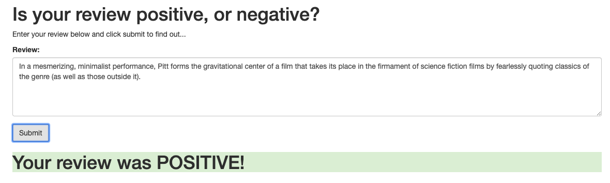
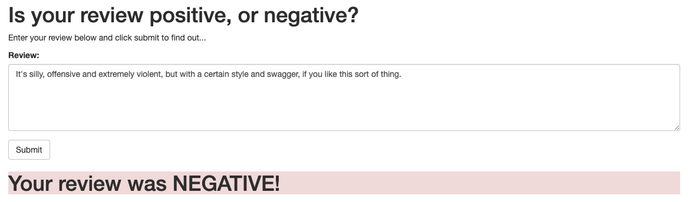

# Creating a Sentiment Analysis Web App Using PyTorch and SageMaker

In this project, we will construct a recurrent neural network for the purpose of determining the sentiment of a movie review using the IMDB data set. We will create this model using Amazon's SageMaker service. In addition, we'll deploy our model and construct a simple web app which will interact with the deployed model.

### General Outline

1. Download or otherwise retrieve the data.
2. Process / prepare the data.
3. Upload the processed data to S3.
4. Train a chosen model.
5. Test the trained model (typically using a batch transform job).
6. Deploy the trained model.
7. Use the deployed model.

## Packages

This project primarily uses torch, sagemaker, pandas, and numpy.

## Motivation

I wanted to be able to deploy a model into production. SageMaker, combined with Lambda and API Gateway, enabled me to deploy a deep learning model that others could then interact with.

## Credit

This was part of Udacity's Deep Learning Nanodegree.

## Files

The two main files are:

- **SageMaker_Project.ipynb**, which walks through creating the endpoints, training, and deploying the model
- **train/model.py**, which contains the simple LSTM model we will use to classify the sentiment

This project uses an Amazon SageMaker notebook instance, along with Lambda and API Gateway, to deploy the web app.

## Results

Once the web app is deployed, users can test it out by entering a movie review. Here are the results from the model on two different movie reviews I grabbed from Rotten Tomatoes.

